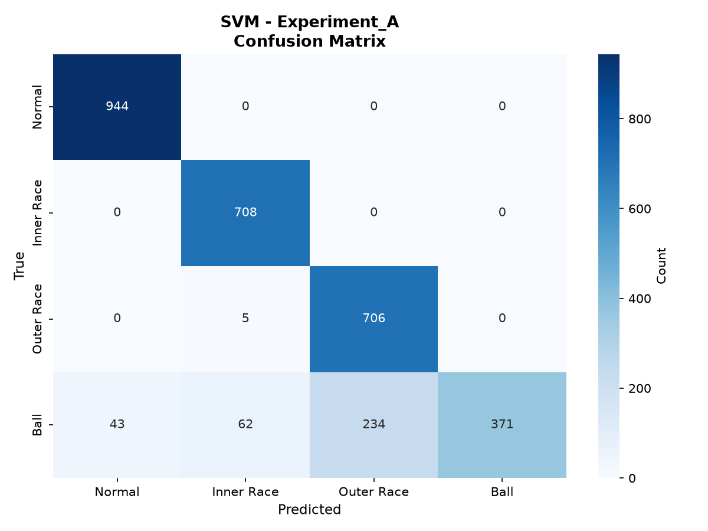
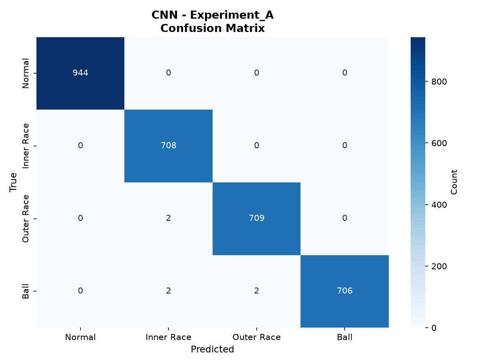

# CWRU 轴承故障诊断 — 可信评估报告

> 生成时间: 2026-06-20 03:10:50
> 数据集: CWRU Bearing Dataset (12k Drive End, 40 files, 4 classes)

---

## 1. 数据集构成

| 类别 | 文件数 | 故障尺寸 (inch) | 负载 (HP) | 窗口数 (约) |
|------|:------:|:---------------:|:---------:|:-----------:|
| 正常 (Normal) | 4 | N/A | 0, 1, 2, 3 | ~3,300 |
| 内圈故障 (Inner Race) | 12 | 0.007, 0.014, 0.021 | 0, 1, 2, 3 | ~2,800 |
| 外圈故障 (Outer Race) | 12 | 0.007, 0.014, 0.021 | 0, 1, 2, 3 | ~2,800 |
| 滚动体故障 (Ball) | 12 | 0.007, 0.014, 0.021 | 0, 1, 2, 3 | ~2,800 |
| **合计** | **40** | | | **~11,800** |

- 采样频率: 12000 Hz
- 窗口长度: 1024 采样点
- 步长: 512 采样点 (重叠率: 50%)

---

## 2. 数据划分方式

### 实验 A: 同工况文件级划分
- 划分策略: 分层文件级划分 (stratified by class at file level)
- 训练/测试: 75% / 25% 文件 (30 训练文件 / 10 测试文件)
- 同一 .mat.txt 文件的窗口绝不会同时出现在训练和测试集
- SVM: 训练集内部 3-fold GroupKFold 手动网格搜索
- CNN: 从训练文件池中再次按文件划分验证集，用于 Early Stopping

### 实验 B: 跨工况泛化
- 划分策略: 按负载划分
- 训练负载: [0, 1, 2] HP
- 测试负载: [3] HP
- 测试集工况在训练阶段完全不可见

---

## 3. 防止数据泄漏的方法

1. **文件级划分**: 按 source file (group_id) 划分，非随机窗口划分
2. **先划分后切窗**: 实际为按文件分组后整体切窗
3. **StandardScaler/PCA 仅 fit 训练集**: 验证集和测试集只 transform
4. **超参数搜索仅用训练集**: GridSearchCV + GroupKFold
5. **CNN Early Stopping 基于验证集**: 测试集仅最终评估一次
6. **自动泄漏检测**: 检查 train/test 文件重叠和窗口哈希重叠
7. **类别权重仅基于训练集计算**

---

## 4. 实验结果

### 4.1 PCA+SVM — 实验 A (文件级划分)

| 指标 | 值 |
|------|:----:|
| Accuracy | 0.8881 |
| Balanced Accuracy | 0.8789 |
| Macro Precision | 0.9053 |
| Macro Recall | 0.8789 |
| Macro F1 | 0.8685 |
| Weighted F1 | 0.8768 |

Per-class Recall:
  - Normal: 1.0000 (support=944)
  - Inner Race: 1.0000 (support=708)
  - Outer Race: 0.9930 (support=711)
  - Ball: 0.5225 (support=710)



### 4.2 1D-CNN — 实验 A (文件级划分)

*3 次独立运行 (不同随机种子), mean ± std*

| 指标 | Mean | Std |
|------|:----:|:---:|
| Accuracy | 0.9993 | 0.0009 |
| Balanced Accuracy | 0.9993 | 0.0010 |
| Macro Precision | 0.9993 | 0.0010 |
| Macro Recall | 0.9993 | 0.0010 |
| Macro F1 | 0.9993 | 0.0010 |
| Weighted F1 | 0.9993 | 0.0009 |

  - Normal Recall: 1.0000 ± 0.0000
  - Inner Race Recall: 1.0000 ± 0.0000
  - Outer Race Recall: 0.9991 ± 0.0013
  - Ball Recall: 0.9981 ± 0.0027



### 4.3 跨工况泛化 (实验 B)

**PCA+SVM** (train loads [0, 1, 2], test loads [3]):
  Accuracy: 0.9623, Balanced Acc: 0.9593, Macro F1: 0.9598
**1D-CNN** (train loads [0, 1, 2], test loads [3]):
  Accuracy: 0.9804 ± 0.0128, Balanced Acc: 0.9788 ± 0.0138, Macro F1: 0.9787 ± 0.0139

---

## 5. 主要发现

- SVM 文件级准确率: 0.8881
- CNN 文件级准确率: 0.9993 ± 0.0009
- 注意: Balanced Accuracy < Accuracy，可能存在类别不均衡影响

---

## 6. 实验局限性

- CWRU 为实验室数据，实际工业场景可能存在更多噪声和工况变化
- 仅有 4 种故障类别，实际场景可能包含复合故障
- 滑动窗口的重叠（50%）意味着相邻窗口高度相关（但已保证同文件不跨集合）
- 跨工况实验仅覆盖 3→1 的负载迁移
- 未使用数据增强（以保证实验可信度）

---

## 7. 复现命令

```bash
cd Industrial-Predictive-Maintenance-Agent
conda activate mypy  # 或使用相应 Python 环境
python tools/run_experiments.py
```

配置文件: `configs/evaluation.yaml`

---

*此报告由 tools/run_experiments.py 自动生成*